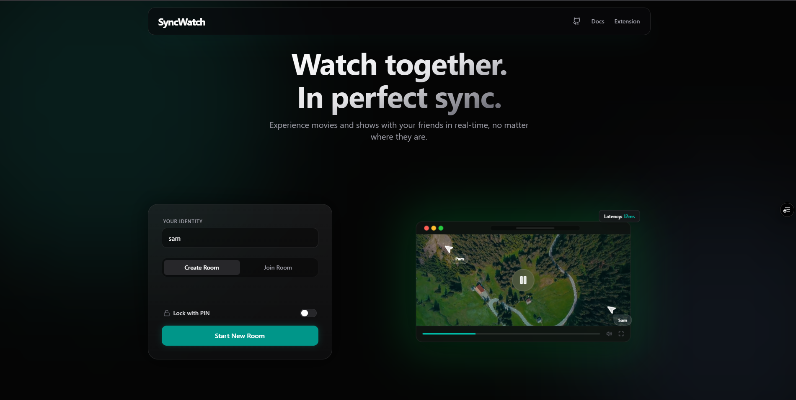
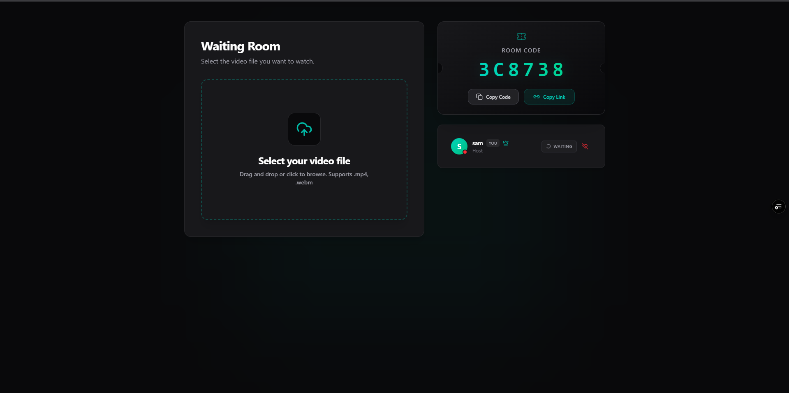

<div align="center">

<br />


<h1>SyncWatch</h1>

<p>
  <strong>Watch together. In perfect sync.</strong><br />
  A premium, zero-upload streaming and watch-party experience.
</p>

<p>
  <a href="https://syncwatch-eosin.vercel.app"></a>
  
  
  <a href="./ARCHITECTURE.md"></a>
</p>

<br />

</div>

---

## 🎬 Distance shouldn't ruin movie night.

Say hello to **SyncWatch**, a masterfully engineered platform designed to let you watch local files and torrents with your friends in absolute, frame-perfect sync. 

Forget waiting hours to upload massive 4K video files, and stop counting down *"3... 2... 1... play"* over Discord. With SyncWatch, you just pick a local file or drop a Magnet link, and the platform handles the rest.

We act as an impossibly fast, sub-second shared remote control. When you pause to grab a snack, the movie pauses for everyone else. When you seek back to catch a missed joke, everyone travels back in time with you.

---

## 📸 Experience the UI

<div align="center">
  
  <br />
  
</div>

---

## ✨ Features that feel like magic

We obsessed over every micro-interaction and technical bottleneck to deliver a true SaaS-grade experience. 

- 🏎️ **Zero-Upload Local Sync:** Watch any file — even massive 4K HDR rips — instantly. Your media never leaves your computer, ensuring total privacy and zero bandwidth costs.
- 🧲 **Native Torrent Engine:** Don't have the file downloaded? Paste a Magnet link and SyncWatch will instantly establish a WebTorrent swarm, syncing playback for everyone straight from the blockchain.
- ⏱️ **Sub-Second PID Drift Correction:** Our custom mathematical engine calculates network RTT (Round Trip Time) and uses a PID controller to imperceptibly adjust playback rates (0.9x to 1.1x), keeping all viewers within 50ms of the host.
- 📝 **Synchronized Subtitles:** Drag and drop `.srt` or `.vtt` files. Subtitles are parsed, rendered flawlessly, and fully synced across all peers in the room.
- 📺 **Binge-Watch Mode:** Select a folder on your computer. When an episode ends, SyncWatch automatically loads the next file in the folder for everyone in the room.
- 🎙️ **Mesh Voice Chat:** Built-in WebRTC peer-to-peer voice chat with real-time waveform speaking indicators. No need for external VoIP apps.
- 💬 **Live Banter:** Real-time text chat, floating emoji reactions, and live typing indicators.
- 🛡️ **Granular Room Controls:** Host-only controls, open democracy (everyone can seek), or delegate control to specific trusted friends. Lock rooms with custom PINs.
- 🎨 **Cinematic Theater Mode:** A stunning, hardware-accelerated ambient glow that dynamically reacts to the colors of the video frame, wrapped in a polished, glassmorphic UI driven by Framer Motion.

---

## 🚀 Quick Start (Be watching in 60 seconds)

### Prerequisites:
- Node.js (v18+)
- A Redis instance (Local or Upstash)
- Firebase Project (for Auth & Profiles)

### Local Environment:

```bash
# 1. Grab the code
git clone https://github.com/sampratigaurav/syncwatch.git
cd syncwatch

# 2. Install dependencies (monorepo)
npm install

# 3. Setup Backend Environment (.env in server folder)
echo "PORT=3001
REDIS_URL=redis://localhost:6379
CLIENT_ORIGIN=http://localhost:5174" > server/.env

# 4. Setup Frontend Environment (.env.local in client folder)
echo "VITE_SERVER_URL=http://localhost:3001
VITE_FIREBASE_API_KEY=your_key
VITE_FIREBASE_AUTH_DOMAIN=your_domain
VITE_FIREBASE_PROJECT_ID=your_id
VITE_FIREBASE_APP_ID=your_app_id" > client/.env.local

# 5. Boot it up!
npm run dev
```

Boom. You're live. Head over to `http://localhost:5174` and start a room.

---

## 🤓 For the Hardcore Engineers

Are you wondering how we calculate Perceptual Sync? Want to see how the PID controller adjusts `playbackRate` dynamically without audio distortion? Intrigued by how we securely bridge WebRTC DataChannels for the torrent swarms?

We moved all the juicy technical details into a dedicated architecture doc so we wouldn't scare away the normal folks.

👉 **[Dive into the ARCHITECTURE.md 🏗️](./ARCHITECTURE.md)**

---

## 🌍 Deploying to Production

SyncWatch is built to be deployed seamlessly. 
- **Frontend:** Optimized for Vercel, Netlify, or Cloudflare Pages (Fully PWA ready).
- **Backend:** Deploy the Node.js Socket.IO server to Render, Railway, or Fly.io.
- **Database:** Free Redis tier on Upstash + Firebase Authentication.

*Need detailed deployment steps? [Read the guide in the Architecture docs](./ARCHITECTURE.md).*

---

## 💛 Support the Project

SyncWatch is 100% free and open source. If it made your movie nights a little less chaotic and a lot more fun, please consider supporting the project:

- ⭐ **Star this repository** (It genuinely helps so much!)
- ☕ [Buy me a Coffee on Ko-fi](https://ko-fi.com/sampratigaurav)
- 🇮🇳 UPI (India): `sampratigaurav123@okaxis`

<br />

<div align="center">
  <sub>Built with ❤️ by Samprati Gaurav &nbsp;·&nbsp; <a href="https://syncwatch-eosin.vercel.app">Live Demo</a> &nbsp;·&nbsp; <a href="https://github.com/sampratigaurav/syncwatch/issues">Report a Bug</a></sub>
</div>
